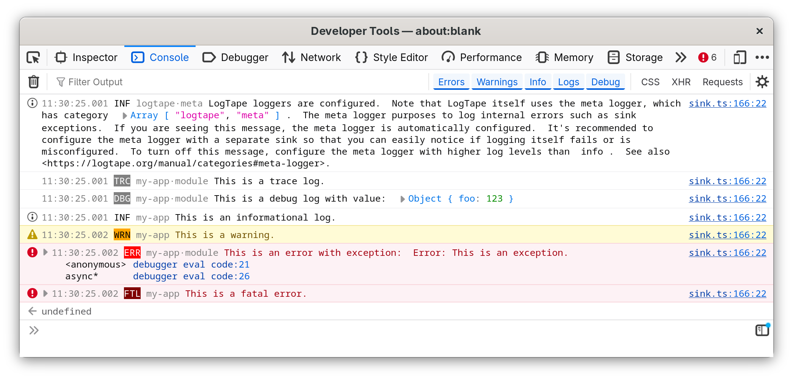
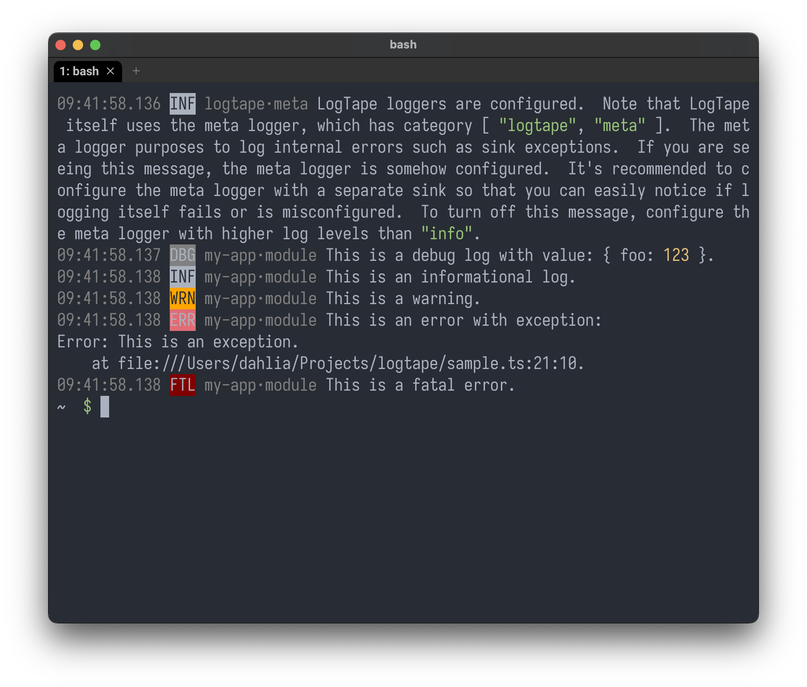

<!-- deno-fmt-ignore-file -->

LogTape
=======

[![JSR][JSR badge]][JSR]
[![npm][npm badge]][npm]
[![GitHub Actions][GitHub Actions badge]][GitHub Actions]
[![Codecov][Codecov badge]][Codecov]

LogTape is a logging library for JavaScript and TypeScript.  It provides a
simple and flexible logging system that is easy to use and easy to extend.
The highlights of LogTape are:

 -  *Zero dependencies*: LogTape has zero dependencies.  You can use LogTape
    without worrying about the dependencies of LogTape.

 -  *[Library support]*: LogTape is designed to be used in libraries as well
    as applications.  You can use LogTape in libraries to provide logging
    capabilities to users of the libraries.

 -  *[Runtime diversity]*: LogTape supports Deno, Node.js, Bun, edge functions,
    and browsers.  You can use LogTape in various environments without
    changing the code.

 -  *[Structured logging]*: You can log messages with structured data.

 -  *[Hierarchical categories]*: LogTape uses a hierarchical category system
    to manage loggers.  You can control the verbosity of log messages by
    setting the log level of loggers at different levels of the category
    hierarchy.

 -  *[Template literals]*: LogTape supports template literals for log messages.
    You can use template literals to log messages with placeholders and
    values.

 -  *[Dead simple sinks]*: You can easily add your own sinks to LogTape.

[JSR]: https://jsr.io/@logtape/logtape
[JSR badge]: https://jsr.io/badges/@logtape/logtape
[npm]: https://www.npmjs.com/package/@logtape/logtape
[npm badge]: https://img.shields.io/npm/v/@logtape/logtape?logo=npm
[GitHub Actions]: https://github.com/dahlia/logtape/actions/workflows/main.yaml
[GitHub Actions badge]: https://github.com/dahlia/logtape/actions/workflows/main.yaml/badge.svg
[Codecov]: https://codecov.io/gh/dahlia/logtape
[Codecov badge]: https://codecov.io/gh/dahlia/logtape/graph/badge.svg?token=yOejfcuX7r
[Library support]: https://logtape.org/manual/library
[Runtime diversity]: https://logtape.org/manual/install
[Structured logging]: https://logtape.org/manual/struct
[Hierarchical categories]: https://logtape.org/manual/categories
[Template literals]: https://logtape.org/manual/start#how-to-log
[Dead simple sinks]: https://logtape.org/manual/sinks

Installation
------------

LogTape is available on [JSR] and [npm].  You can install LogTape for various
JavaScript runtimes and package managers:

~~~~ sh
deno add @logtape/logtape  # for Deno
npm  add @logtape/logtape  # for npm
pnpm add @logtape/logtape  # for pnpm
yarn add @logtape/logtape  # for Yarn
bun  add @logtape/logtape  # for Bun
~~~~

See also the [installation manual][Runtime diversity] for more details.

Docs
----

The docs of LogTape is available at <https://logtape.org/>.
For the API references, see <https://jsr.io/@logtape/logtape>.
